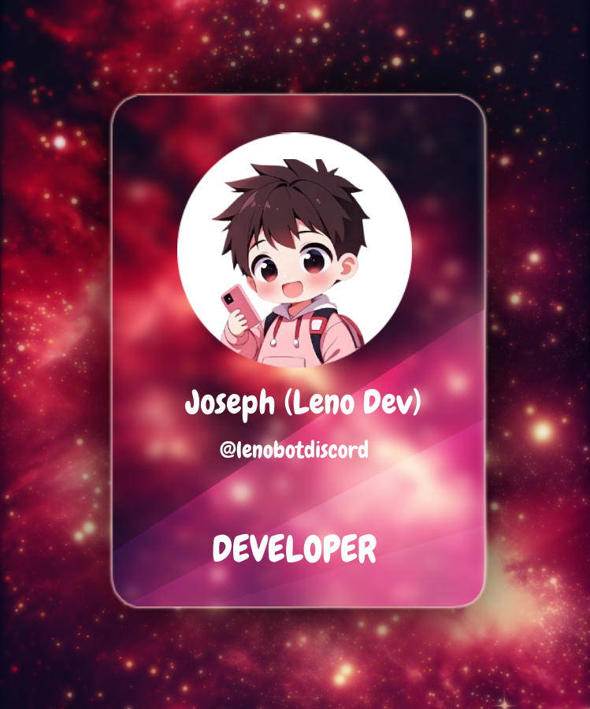

<h1 align="left">Hi 👋 I'm Joseph</h1>

### 💻 Currently working on
#### _CustomEmbed and Pagination Handler for Discord.js_

This package provides utilities for creating custom embeds and handling paginated embeds in a Discord bot using `discord.js`. It includes a `CustomEmbed` class for easily generating embeds with a default style and a `handlePagination` function for interactive pagination with buttons.

- for more detailed info [check out!](https://www.npmjs.com/package/lenopackage)

### 🤖 Leno Discord Bot Status
Bot Status: 🟢 Online

# ✨ Ambitions

- ⭐ _Be the best at what I do_
- 🔭 _Learn more every day_
- 🔎 _Always ready to help anyone_
- 🧑🏽‍💻 _Help to solve bug's and more_

## 🔨 Language and Tools

## Contributions

Contributions are welcome! Feel free to submit a pull request or open an issue to suggest improvements or report bugs.

- [Discord Server](https://discord.gg/PNpVAp2vwP)
- [Our Site](https://lenobot.xyz)
- [Joseph e-Mail](mailto:developer@lenobot.xyz)
- [Leno Support e-Mail](mailto:support@lenobot.xyz)

  
 

  
Github Stats ⚡

  
  
  

